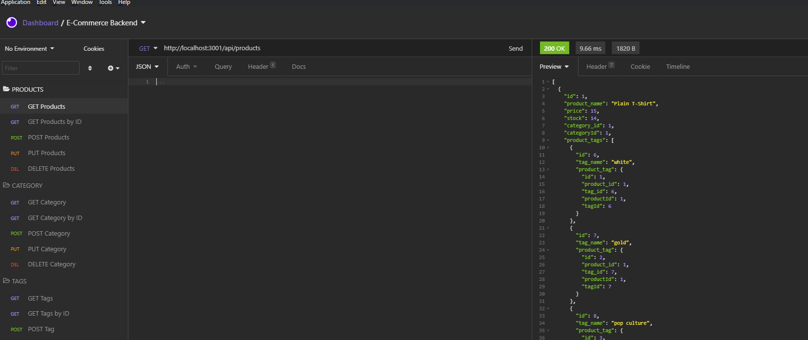

    
    
    
    
    
    

  

    
    
    
    
    
    

# The Ecommerce Backend! A Test in Table Associations and Real World Data! 

## Description
This is a simple command line application that configures API routes and API end point data for a database. This structure is common among real world e-commerce websites/platforms.

Please watch this instructional walkthrough video: https://youtu.be/iEAfTyJPoEo

## Table of Contents
- [Usage](#usage)
- [Credits](#credits)
- [License](#license)
 
## Usage
- Run `npm i` to install app dependencies
- Configure your database with the `./db/schema.sql` file
- Seed your database with the `npm seed` command. If this fails, please use `node seeds/index.js` 
- Run `npm start` in the terminal to start the application!
- Open Insomnia to test your API routes!
    
## License
License: MIT

## Built With Node.js And These Node Packages
* [MySQL](https://www.mysql.com/)
* [Express.js](https://expressjs.com/)
* [Sequelize](https://www.npmjs.com/package/sequelize)
* [Node.js](https://nodejs.org/en/)
* [npmjs](https://docs.npmjs.com/)

## How to Contribute
If you would like to contribute to this project, please fork the project as needed.

## Questions
Have any questions for the author? Contact this author via [Email](mailto:aaronlucht@gmail.com)

Check out the author's [Github](https://github.com/d606n6k)

## Credits
    
Created by [d606n6k](https://github.com/d606n6k)
